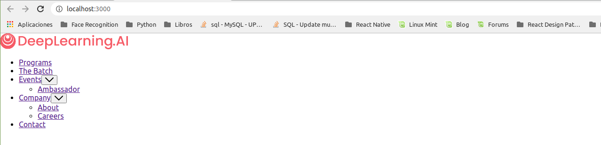
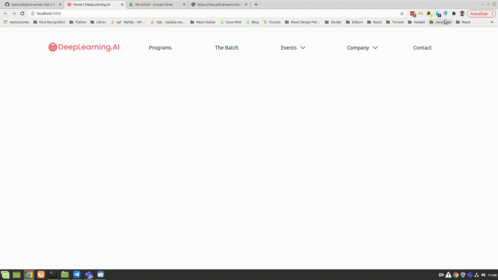
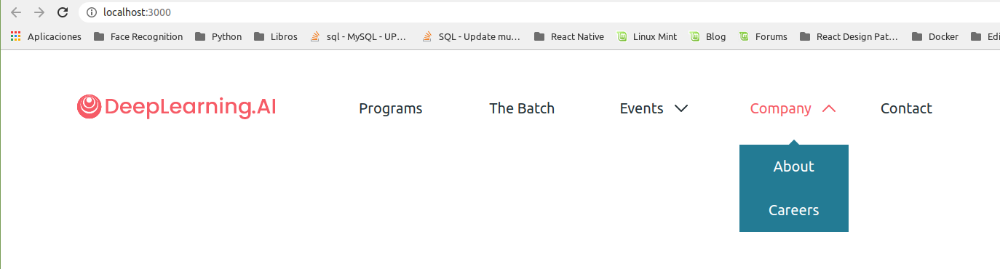
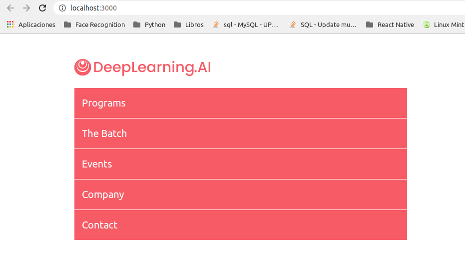
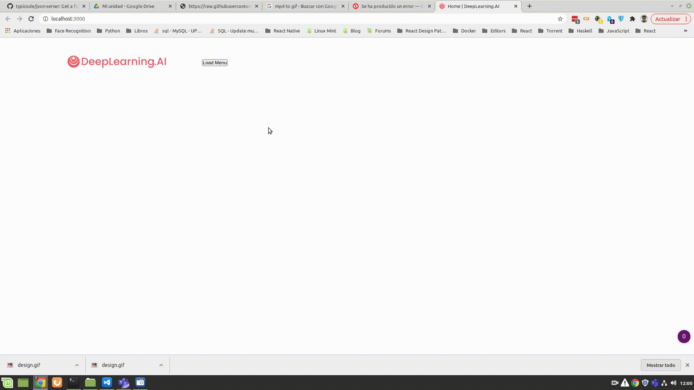
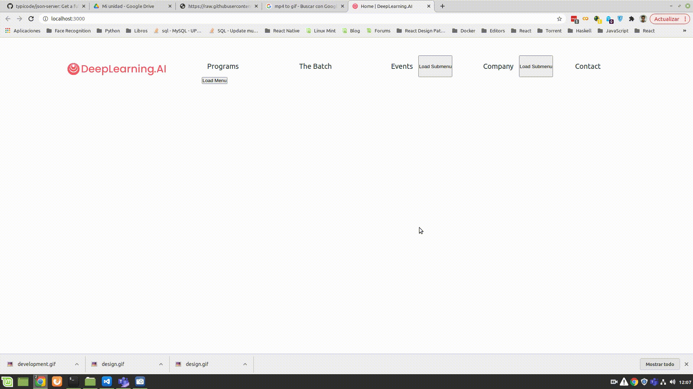

# Examen Segunda Evaluación

# Día 02/02/2021 Tiempo: 5 horas

- Nota: Cada pregunta se valorará como bien o como mal (valoraciones intermedias serán excepcionales).
- Nota2: En cada pregunta se especifica si se valora en el examen de diseño o en el de desarrollo.
- Nota3: Para aprobar cada examen hay que obtener una puntuación mínima de 5 puntos en ese examen.
- Nota4: Organice su tiempo. Si no consigue resolver un apartado pase al siguiente. El examen consta de apartados de diseño y de desarrollo que se pueden resolver por separado. Si un apartado depende de otro que no sabe resolver, siempre puede dar una solución que aunque no sea correcta, le permita seguir avanzando.
- Nota5: Para que una solución sea correcta, no sólo hay que conseguir que haga lo que se pide, sino que además todo lo que funcionaba lo tiene que seguir haciendo. La solución debe estar implementada según las prácticas de código limpio explicadas en clase.
- Nota6: No se permiten modificaciones sustanciales del código que se le suministra en el enunciado, aunque sí puede hacer pequeñas variaciones. Concretamente, en el examen de diseño no se permite modificar el fichero "Header.js" y en el examen de desarrollo no se permite modificar el fichero "menuServices.js" ni la estructura de los menus/submenus del fichero "menu.json". Tampoco se permite utilizar ninguna librería que no esté ya incluida en el fichero "package.json"
- Nota7: Lea completamente el examen antes de empezar y comience por lo que le parezca más fácil.

Pasos previos antes de empezar

- Clone el repositorio del enunciado

```bash
git clone https://gitlab.com/surtich/enunciado-examen-segunda.git enunciado-examen
```

- Vaya al directorio del proyecto

```bash
cd enunciado-examen
```

- Configure su usuario de git:

```bash
git config user.name "Sustituya por su nombre y apellidos"
git config user.email "Sustituya por su correo electrónico"
```

- Cree un _branch_ con su nombre y apellidos separados con guiones (no incluya mayúsculas, acentos o caracteres no alfabéticos, excepción hecha de los guiones). Ejemplo:

```bash
    git checkout -b <fulanito-perez-gomez>
```

- Compruebe que está en la rama correcta:

```bash
    git status
```

- Suba la rama al repositorio remoto:

```bash
    git push origin <nombre-de-la-rama-dado-anteriormente>
```

- Instale las dependencias y arranque la aplicación:

```bash
    yarn install
    yarn start
```

Navegue a [http://localhost:3000](http://localhost:3000)


Debería ver esto:




- Dígale al profesor que ya ha terminado para que compruebe que todo es correcto y desconecte la red.

## EXAMEN DE DISEÑO

Nota: En este examen no puede modificar el código HTML, todo debe hacerse con CSS.

#### 1.- Realizar el diseño del menú usando principalmente FlexBox. Debe usar posicionamiento absoluto sólo cuando sea necesario.

El resultado final será:





#### 1.1.- (1 punto diseño) Usando Flexbox, posicione el menú principal de forma horizontal y dé estilo, alineación, tamaño y espaciado de cada elemento del menú.

#### 1.2.- (0.5 puntos diseño) Al situarse encima de cada elemento del menú cambiará su color a "primary".

#### 1.3.- (1 punto diseño) El botón para indicar que hay un submenú tendrá el estilo y posición que se indica la imagen.

#### 1.4.- (1 punto diseño) El botón rotará (ver el menú "Company") cuando se sitúe encima del menú. 
Atención: la rotación se producirá cuando esté encima del menu__item, no solamente cuando esté encima del botón.

#### 1.5.- (1 punto diseño) Los submenús estarán ocultos y solamente se mostrarán cuando se sitúe encima del menú. 

#### 1.6.- (2 puntos diseño) Los submenús tendrán el estilo de la imagen.
Pista: La "punta de flecha" se puede conseguir rotando un elemento "before" o "after".

### 1.7.- Cuando la pantalla sea menor que 1.100px, el menú se transformará según lo mostrado en la imagen.



Concretamente:

#### 1.7.1- (1 punto diseño) Los menús serán verticales y con el estilo y alineación de la imagen.

#### 1.7.2- (1 punto diseño) El ancho del menú se ajustará a la pantalla dejando un margen.

#### 1.7.3- (0.5 puntos diseño) Los menús tendrán una línea de separación entre ellos.

#### 1.7.4- (1 punto diseño) No habrá "efecto hover". Es decir, que los menús no cambiarán de estilo ni se mostrarán/ocultarán los submenús.
Nota: Para puntuar en este apartado debe haber realizado lo indicado en 1.5.


## EXAMEN DE DESARROLLO CLIENTE

Importante: Antes de comenzar con este examen, es conveniente que haga un commit de la parte de diseño

```bash
    git add .
    git commit -m "completed exam of design"
```

Se pretende que haga lo que se muestra en el vídeo:



Es decir, que los menús se carguen dinámicamente. Para ello se ha preparado el archivo "menuServices.js" que se encarga de la comunicación con el "back". Debe usar los "endpoints" de este fichero sin modificarlo y pasando a cada función los parámetros requeridos. Puede comprobar lo que devuelve cada función con un "console.log" o en la sección "Network/Red" de su navegador.

La implementación hay que hacerla en React y tiene que seguir las buenas prácticas de este "framework".

#### 2.1.- (2 puntos desarrollo) Elimine los menús estáticos de "Header.js" y sustitúyalos por un botón, que cuando se pulse, llame al servicio "getAsyncMenu". Durante el tiempo de espera, se verá en pantalla "loading" y cuando hayan recuperado los datos se mostrarán los menús. Este botón se podrá llamar todas las veces que se quiera y siempre tendrá el mismo comportamiento: Se ocultarán los menús y se podrá "loading" y se mostrará el menú cuando se haya cargado. Aquellos menús cuyo atributo "withSubmenu" tenga valor "true", tendrán un botón "Load submenu" a su lado que permita cargar los submenús.

Nota: Observe la estructura de cada menú en el fichero "menu.json".

#### 2.2.- (2 puntos desarrollo) Cuando se pulse sobre el botón "Load submenu", se llamará al servicio "getAsyncSubmenu" que permitirá cargar un submenú concreto. Durante la carga se verá "loading" al lado del submenú y una vez que se haya cargado se verá la flecha de submenú y los submenús cargados. Puede pulsar este botón todas las veces que se quiera y siempre tendrá el mismo comportamiento: Se ocultarán los submenús y se podrá "loading" y se mostrarán cuando se hayan cargado (no antes).

#### 2.3.- (2 puntos desarrollo) Cada submenú tendrá un botón para borrar ese submenú. Cuando lo pulse, deberá llamar al servicio "deleteAsyncSubmenu" con el parámetro "withError = false". ¡SÓLO! Cuando este servicio haya terminado, deberá borrar el submenú del cliente. Es decir, el submenú se elimina del cliente una vez que se haya borrado del "back".

#### 2.4.- (2 puntos desarrollo) Cuando un menú se quede sin submenús, por haberse borrado todos, deberá llamar al servicio "updateAsyncMenu" que permite actualizar el valor de "withSubmenu" de un menú. Cuando este servicio haya terminado, deberá elimninar en el cliente la flecha de selección y el botón de submenús.

#### 2.5.- (2 puntos desarrollo) Cuando llame al servico "deleteAsyncSubmenu" con el parámetro "withError = true", el servidor no borra el submenú y devuelve la petición con error. Asegúrese que no se hace ningún cambio en el cliente cuando el servidor devuelva un error, únicamente se podrá un mensaje de error indicando que algo ha ido mal (vea el vídeo). Cuando esto ocurra (la petición devuelva error), tampoco debe llamarse a "updateAsyncMenu" incluso si el submenú que se pretendía borrar era el último de ese menú ya que no se ha podido hacer. 



## Para entregar

- Ejecute el siguiente comando para comprobar que está en la rama correcta y ver los ficheros que ha cambiado:

```bash
    git status
```

- Prepare los cambios para que se añadan al repositorio local:

```bash
    git add .
    git commit -m "completed exam"
```

- Compruebe que no tiene más cambios que incluir:

```bash
    git status
```

- Dígale al profesor que va a entregar el examen.

- Conecte la red y ejecute el siguiente comando:

```bash
    git push origin <nombre-de-la-rama>
```

- Abandone el aula en silencio.
